# Workflow
This template file helps in annotating Hartree-Fock Mean-Field theory papers by providing a collection of prompts, which should be followed in a specific order based on the type of the paper.

We categorized the papers based on:
* Hamiltonian: continuum | lattice
* Formalism: first-quantized | second-quantized
* Order parameter: Hartree | Fock | Hartree-Fock 

**Note:** The combination of 'lattice' and 'first-quantized' is incompatible.

Detailed workflows for each paper category are as follows:

## lattice, second-quantized, Hartree
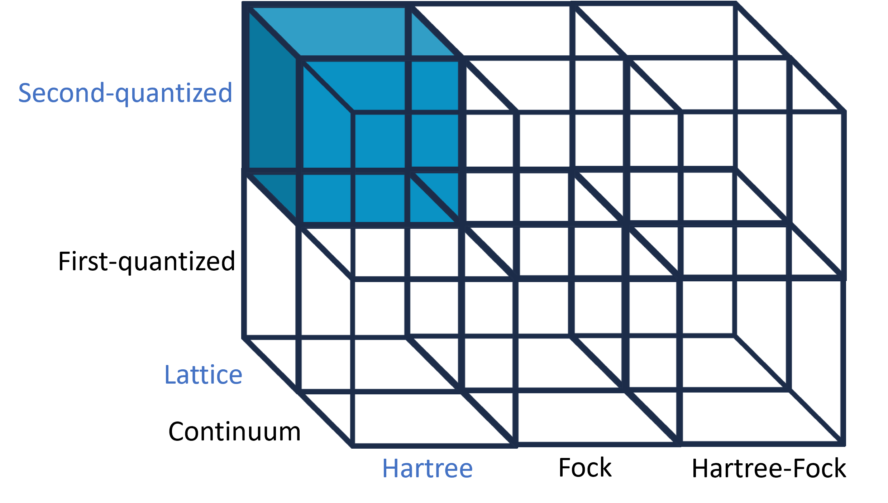
**Example**: [1106.6060](1106.6060/1106.6060.md)
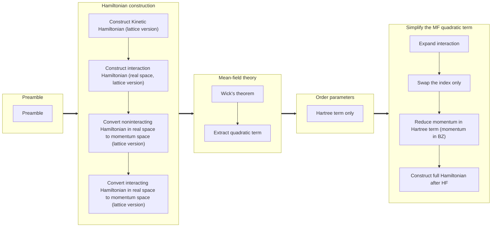
```mermaid
flowchart LR
    subgraph A["Preamble"]
        direction TB
        a1["Preamble"]
    end
    subgraph B["Hamiltonian construction"]
        direction TB
        b1["Construct Kinetic Hamiltonian (lattice version)"]
        b2["Construct interaction Hamiltonian (real space, lattice version)"]
        b3["Convert noninteracting Hamiltonian in real space to momentum space (lattice version)"]
        b4["Convert interacting Hamiltonian in real space to momentum space (lattice version)"]
        b1-->b2
        b2-->b3
        b3-->b4
    end
    subgraph C["Mean-field theory"]
        direction TB
        c1["Wick's theorem"]
        c2["Extract quadratic term"]
        c1-->c2
    end
    subgraph D["Order parameters"]
        direction TB
        d1["Hartree term only"]
    end
    subgraph E["Simplify the MF quadratic term"]
        direction TB
        e1["Expand interaction"]
        e2["Swap the index only"]
        e3["Reduce momentum in Hartree term (momentum in BZ)"]
        e4["Construct full Hamiltonian after HF"]
        e1-->e2
        e2-->e3
        e3-->e4
    end
    A==>B
    B==>C
    C==>D
    D==>E
```
## lattice, second-quantized, Fock
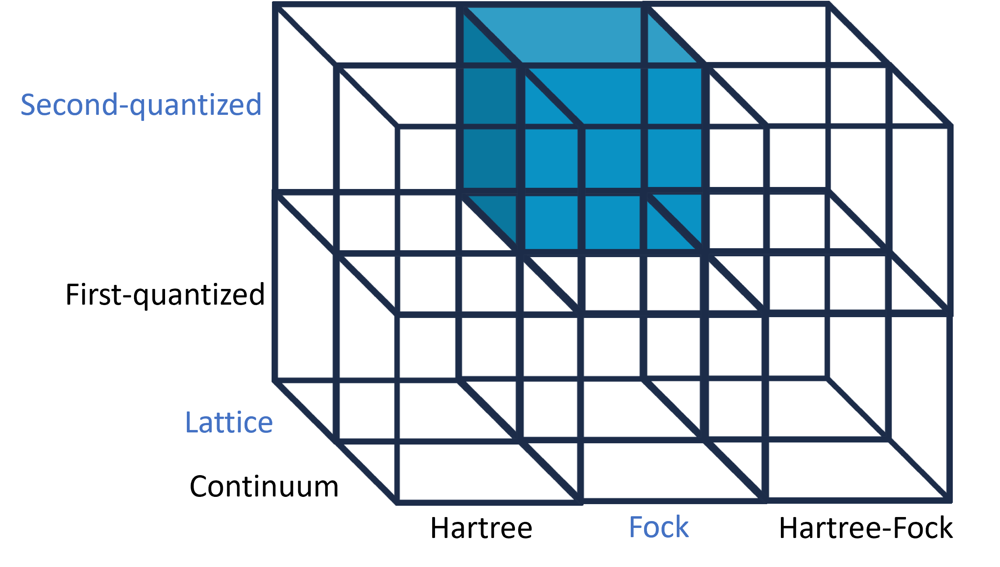
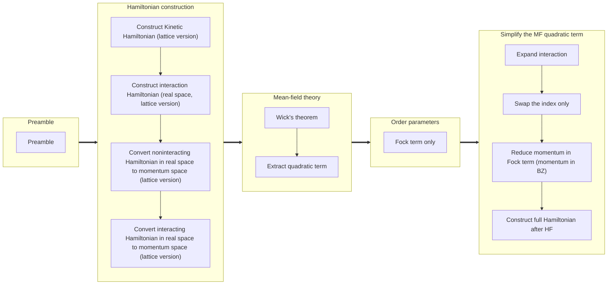
```mermaid
flowchart LR
    subgraph A["Preamble"]
        direction TB
        a1["Preamble"]
    end
    subgraph B["Hamiltonian construction"]
        direction TB
        b1["Construct Kinetic Hamiltonian (lattice version)"]
        b2["Construct interaction Hamiltonian (real space, lattice version)"]
        b3["Convert noninteracting Hamiltonian in real space to momentum space (lattice version)"]
        b4["Convert interacting Hamiltonian in real space to momentum space (lattice version)"]
        b1-->b2
        b2-->b3
        b3-->b4
    end
    subgraph C["Mean-field theory"]
        direction TB
        c1["Wick's theorem"]
        c2["Extract quadratic term"]
        c1-->c2
    end
    subgraph D["Order parameters"]
        direction TB
        d1["Fock term only"]
    end
    subgraph E["Simplify the MF quadratic term"]
        direction TB
        e1["Expand interaction"]
        e2["Swap the index only"]
        e3["Reduce momentum in Fock term (momentum in BZ)"]
        e4["Construct full Hamiltonian after HF"]
        e1-->e2
        e2-->e3
        e3-->e4
    end
    A==>B
    B==>C
    C==>D
    D==>E
```
## lattice, second-quantized, Hartree-Fock
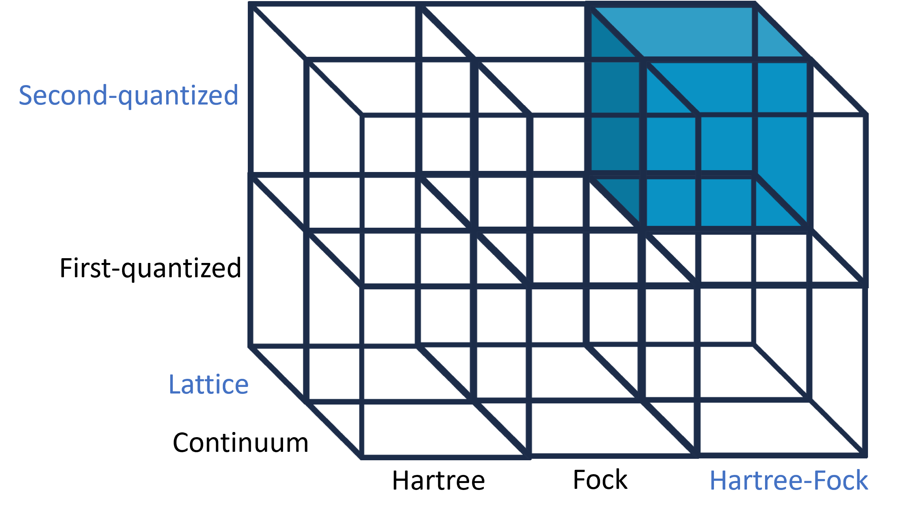
**Example**: [2004.04168](2004.04168/2004.04168.md)
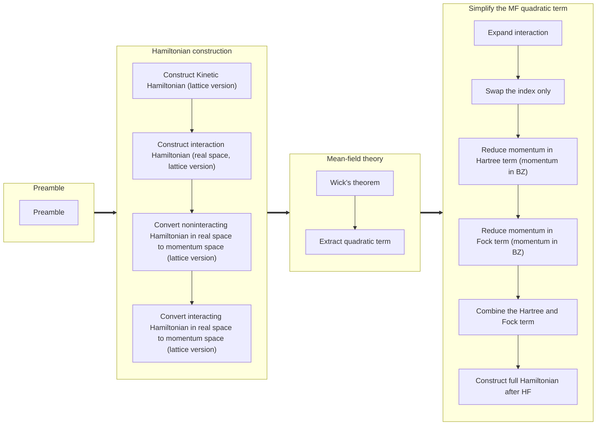
```mermaid
flowchart LR
    subgraph A["Preamble"]
        direction TB
        a1["Preamble"]
    end
    subgraph B["Hamiltonian construction"]
        direction TB
        b1["Construct Kinetic Hamiltonian (lattice version)"]
        b2["Construct interaction Hamiltonian (real space, lattice version)"]
        b3["Convert noninteracting Hamiltonian in real space to momentum space (lattice version)"]
        b4["Convert interacting Hamiltonian in real space to momentum space (lattice version)"]
        b1-->b2
        b2-->b3
        b3-->b4
    end
    subgraph C["Mean-field theory"]
        direction TB
        c1["Wick's theorem"]
        c2["Extract quadratic term"]
        c1-->c2
    end
    subgraph E["Simplify the MF quadratic term"]
        direction TB
        e1["Expand interaction"]
        e2["Swap the index only"]
        e3["Reduce momentum in Hartree term (momentum in BZ)"]
        e4["Reduce momentum in Fock term (momentum in BZ)"]
        e5["Combine the Hartree and Fock term"]
        e6["Construct full Hamiltonian after HF"]
        e1-->e2
        e2-->e3
        e3-->e4
        e4-->e5
        e5-->e6
    end
    A==>B
    B==>C
    C==>E
```

## continuum, first-quantized, Hartree
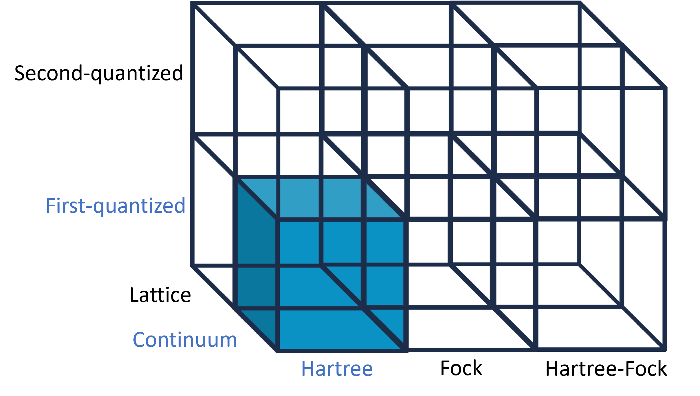
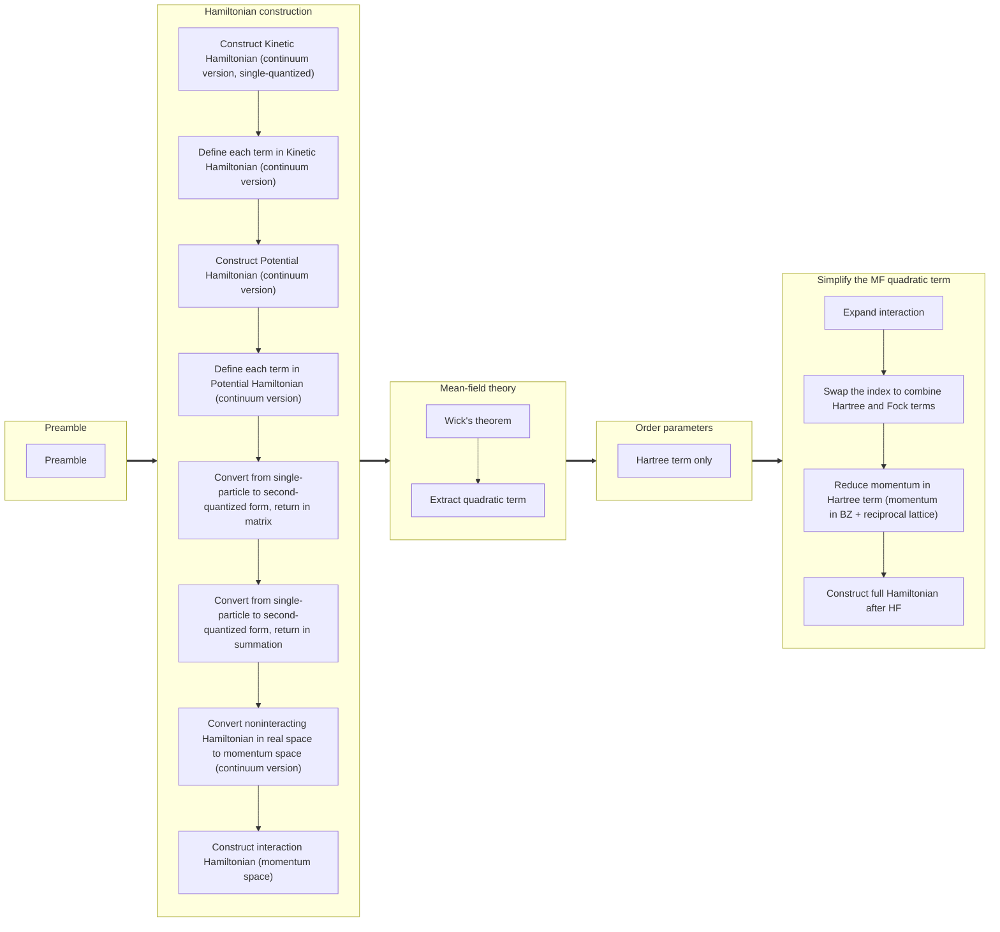
```mermaid
flowchart LR
    subgraph A["Preamble"]
        direction TB
        a1["Preamble"]
    end
    subgraph B["Hamiltonian construction"]
        direction TB
        b1["Construct Kinetic Hamiltonian (continuum version, single-quantized)"]
        b2["Define each term in Kinetic Hamiltonian (continuum version)"]
        b3["Construct Potential Hamiltonian (continuum version)"]
        b4["Define each term in Potential Hamiltonian (continuum version)"]
        b5["Convert from single-particle to second-quantized form, return in matrix"]
        b6["Convert from single-particle to second-quantized form, return in summation"]
        b7["Convert noninteracting Hamiltonian in real space to momentum space (continuum version)"]
        b8["Construct interaction Hamiltonian (momentum space)"]
        b1-->b2
        b2-->b3
        b3-->b4
        b4-->b5
        b5-->b6
        b6-->b7
        b7-->b8
    end
    subgraph C["Mean-field theory"]
        direction TB
        c1["Wick's theorem"]
        c2["Extract quadratic term"]
        c1-->c2
    end
    subgraph D["Order parameters"]
        direction TB
        d1["Hartree term only"]
    end
    subgraph E["Simplify the MF quadratic term"]
        direction TB
        e1["Expand interaction"]
        e2["Swap the index to combine Hartree and Fock terms"]
        e3["Reduce momentum in Hartree term (momentum in BZ + reciprocal lattice)"]
        e4["Construct full Hamiltonian after HF"]
        e1-->e2
        e2-->e3
        e3-->e4
    end
    A==>B
    B==>C
    C==>D
    D==>E
```
## continuum, first-quantized, Fock
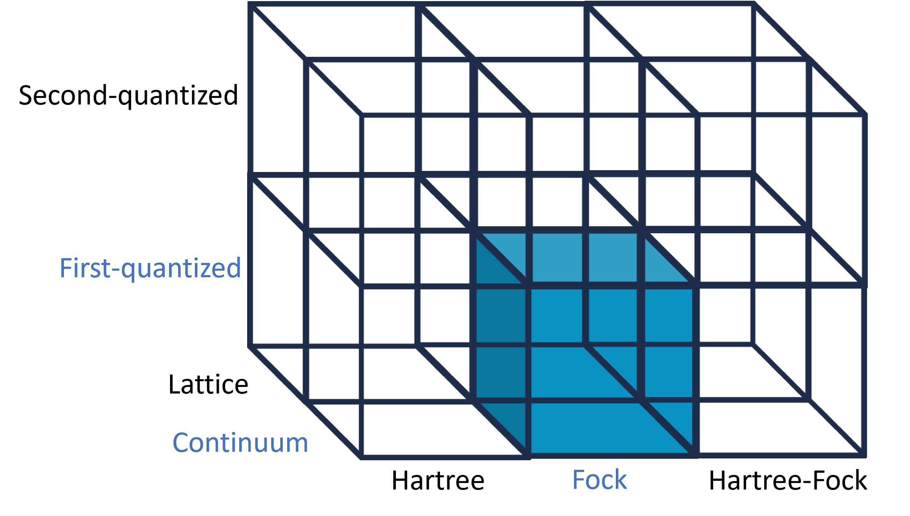

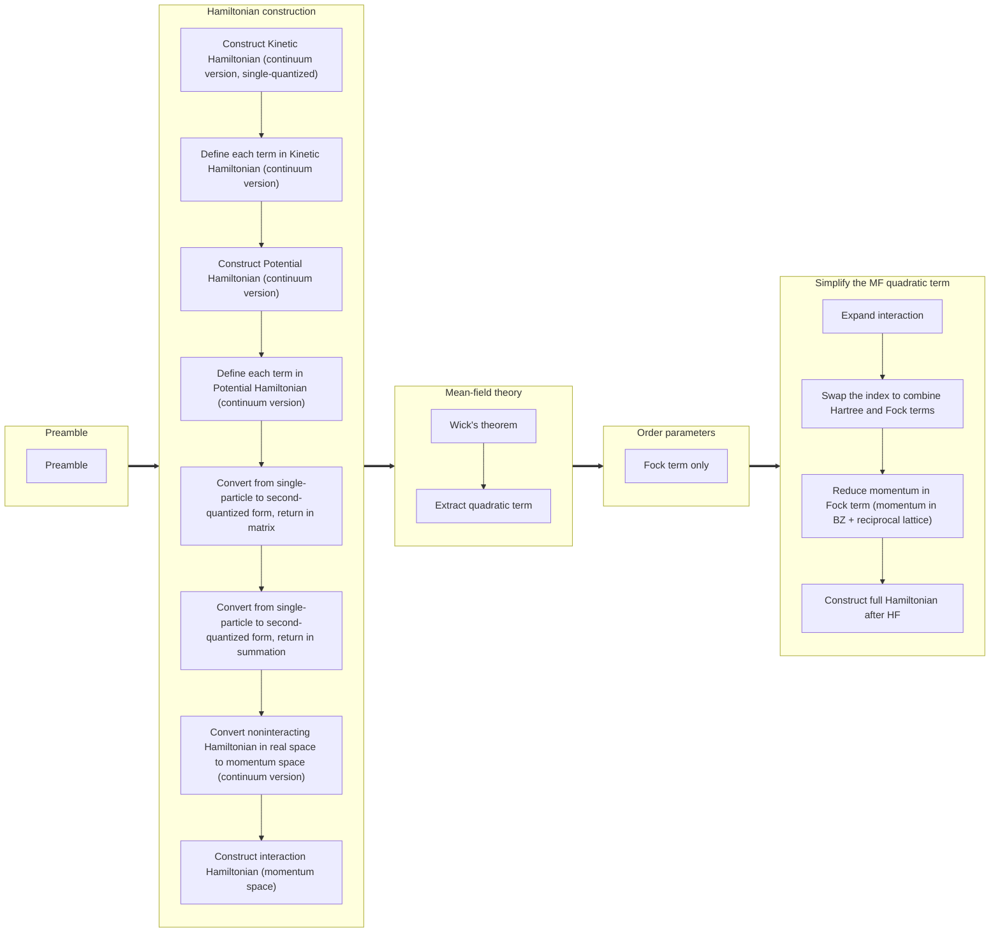
```mermaid
flowchart LR
    subgraph A["Preamble"]
        direction TB
        a1["Preamble"]
    end
    subgraph B["Hamiltonian construction"]
        direction TB
        b1["Construct Kinetic Hamiltonian (continuum version, single-quantized)"]
        b2["Define each term in Kinetic Hamiltonian (continuum version)"]
        b3["Construct Potential Hamiltonian (continuum version)"]
        b4["Define each term in Potential Hamiltonian (continuum version)"]
        b5["Convert from single-particle to second-quantized form, return in matrix"]
        b6["Convert from single-particle to second-quantized form, return in summation"]
        b7["Convert noninteracting Hamiltonian in real space to momentum space (continuum version)"]
        b8["Construct interaction Hamiltonian (momentum space)"]
        b1-->b2
        b2-->b3
        b3-->b4
        b4-->b5
        b5-->b6
        b6-->b7
        b7-->b8
    end
    subgraph C["Mean-field theory"]
        direction TB
        c1["Wick's theorem"]
        c2["Extract quadratic term"]
        c1-->c2
    end
    subgraph D["Order parameters"]
        direction TB
        d1["Fock term only"]
    end
    subgraph E["Simplify the MF quadratic term"]
        direction TB
        e1["Expand interaction"]
        e2["Swap the index to combine Hartree and Fock terms"]
        e3["Reduce momentum in Fock term (momentum in BZ + reciprocal lattice)"]
        e4["Construct full Hamiltonian after HF"]
        e1-->e2
        e2-->e3
        e3-->e4
    end
    A==>B
    B==>C
    C==>D
    D==>E
```

## continuum, first-quantized, Hartree-Fock
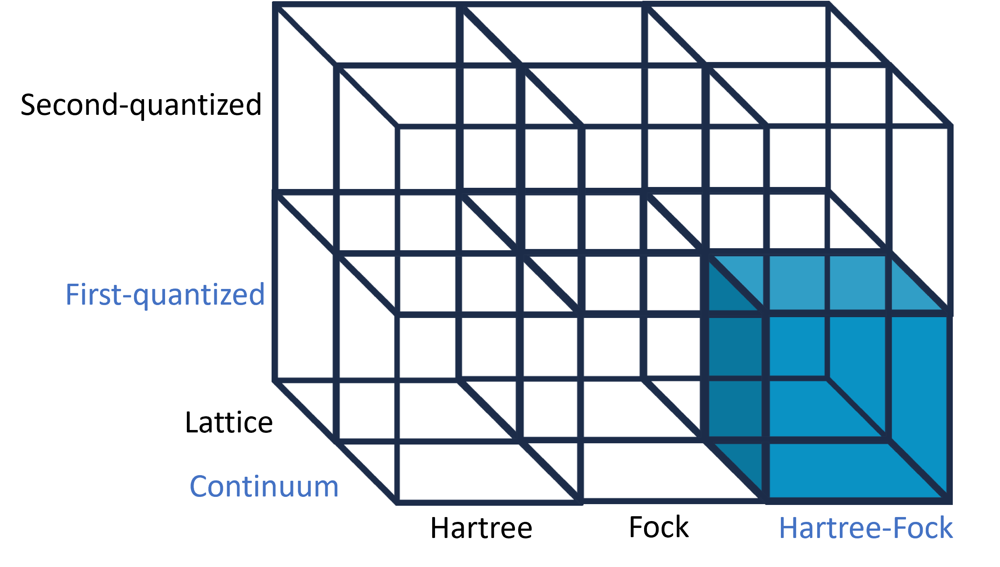
**Example**: [2111.01152](2111.01152/2111.01152.md), [1812.04213](1812.04213/1812.04213.md)
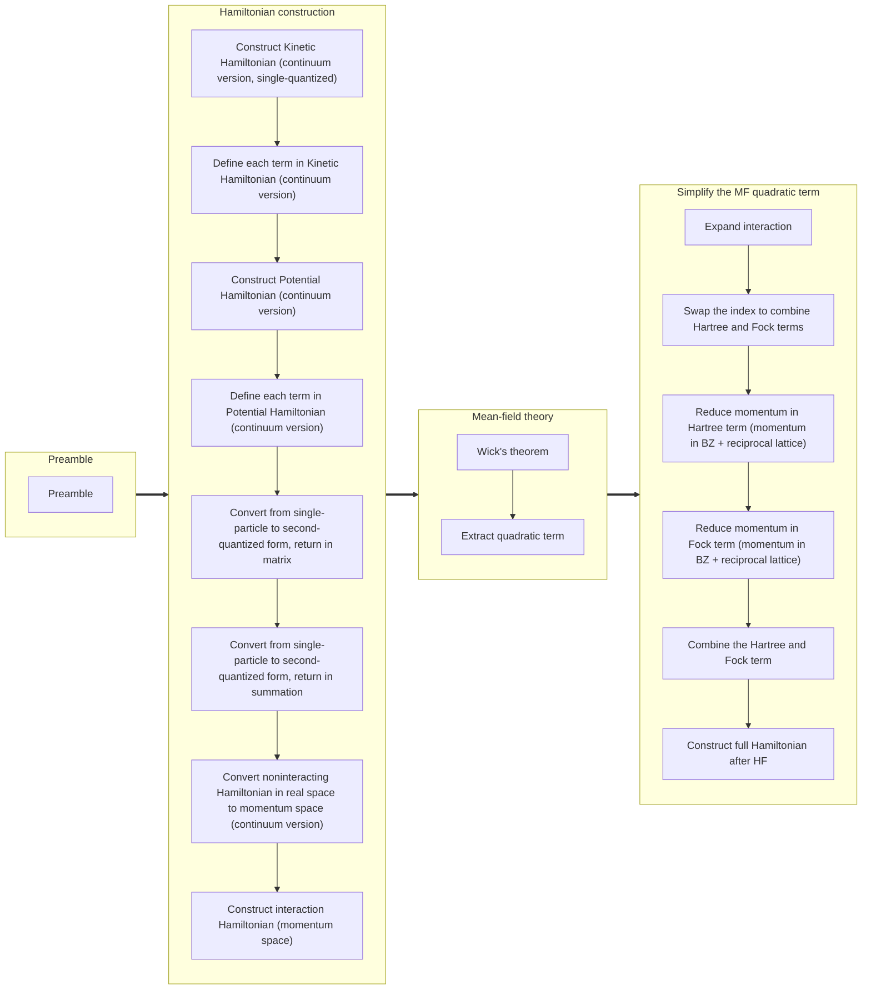
```mermaid
flowchart LR
    subgraph A["Preamble"]
        direction TB
        a1["Preamble"]
    end
    subgraph B["Hamiltonian construction"]
        direction TB
        b1["Construct Kinetic Hamiltonian (continuum version, single-quantized)"]
        b2["Define each term in Kinetic Hamiltonian (continuum version)"]
        b3["Construct Potential Hamiltonian (continuum version)"]
        b4["Define each term in Potential Hamiltonian (continuum version)"]
        b5["Convert from single-particle to second-quantized form, return in matrix"]
        b6["Convert from single-particle to second-quantized form, return in summation"]
        b7["Convert noninteracting Hamiltonian in real space to momentum space (continuum version)"]
        b8["Construct interaction Hamiltonian (momentum space)"]
        b1-->b2
        b2-->b3
        b3-->b4
        b4-->b5
        b5-->b6
        b6-->b7
        b7-->b8
    end
    subgraph C["Mean-field theory"]
        direction TB
        c1["Wick's theorem"]
        c2["Extract quadratic term"]
        c1-->c2
    end
    subgraph E["Simplify the MF quadratic term"]
        direction TB
        e1["Expand interaction"]
        e2["Swap the index to combine Hartree and Fock terms"]
        e3["Reduce momentum in Hartree term (momentum in BZ + reciprocal lattice)"]
        e4["Reduce momentum in Fock term (momentum in BZ + reciprocal lattice)"]
        e5["Combine the Hartree and Fock term"]
        e6["Construct full Hamiltonian after HF"]
        e1-->e2
        e2-->e3
        e3-->e4
        e4-->e5
        e5-->e6
    end
    A==>B
    B==>C
    C==>E
```

## continuum, second-quantized, Hartree
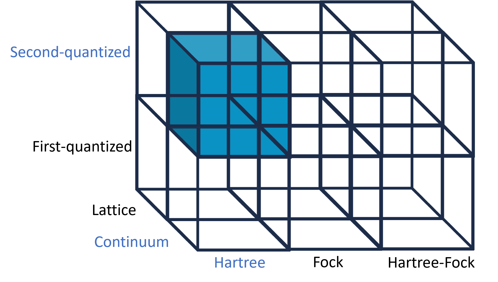

```mermaid
flowchart LR
    subgraph A["Preamble"]
        direction TB
        a1["Preamble"]
    end
    subgraph B["Hamiltonian construction"]
        direction TB
        b1["Construct Kinetic Hamiltonian (continuum version, second-quantized)"]
        b2["Define each term in Kinetic Hamiltonian (continuum version)"]
        b3["Construct Potential Hamiltonian (continuum version)"]
        b4["Define each term in Potential Hamiltonian (continuum version)"]
        b7["Convert noninteracting Hamiltonian in real space to momentum space (continuum version)"]
        b8["Construct interaction Hamiltonian (momentum space)"]
        b1-->b2
        b2-->b3
        b3-->b4
        b4-->b7
        b7-->b8
    end
    subgraph C["Mean-field theory"]
        direction TB
        c1["Wick's theorem"]
        c2["Extract quadratic term"]
        c1-->c2
    end
    subgraph D["Order parameters"]
        direction TB
        d1["Hartree term only"]
    end
    subgraph E["Simplify the MF quadratic term"]
        direction TB
        e1["Expand interaction"]
        e2["Swap the index to combine Hartree and Fock terms"]
        e3["Reduce momentum in Hartree term (momentum in BZ + reciprocal lattice)"]
        e4["Construct full Hamiltonian after HF"]
        e1-->e2
        e2-->e3
        e3-->e4
    end
    A==>B
    B==>C
    C==>D
    D==>E
```
## continuum, second-quantized, Fock
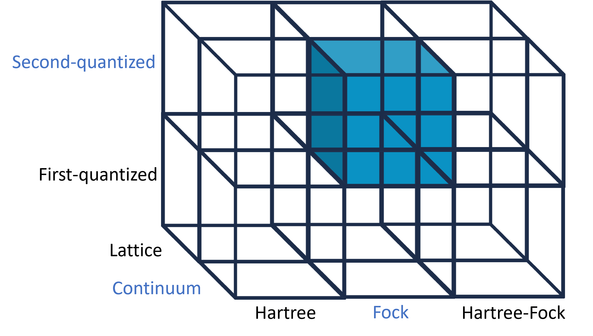
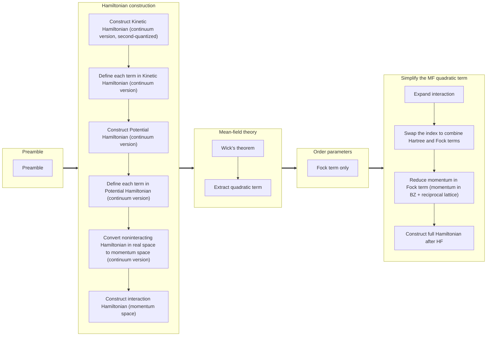
```mermaid
flowchart LR
    subgraph A["Preamble"]
        direction TB
        a1["Preamble"]
    end
    subgraph B["Hamiltonian construction"]
        direction TB
        b1["Construct Kinetic Hamiltonian (continuum version, second-quantized)"]
        b2["Define each term in Kinetic Hamiltonian (continuum version)"]
        b3["Construct Potential Hamiltonian (continuum version)"]
        b4["Define each term in Potential Hamiltonian (continuum version)"]
        b7["Convert noninteracting Hamiltonian in real space to momentum space (continuum version)"]
        b8["Construct interaction Hamiltonian (momentum space)"]
        b1-->b2
        b2-->b3
        b3-->b4
        b4-->b7
        b7-->b8
    end
    subgraph C["Mean-field theory"]
        direction TB
        c1["Wick's theorem"]
        c2["Extract quadratic term"]
        c1-->c2
    end
    subgraph D["Order parameters"]
        direction TB
        d1["Fock term only"]
    end
    subgraph E["Simplify the MF quadratic term"]
        direction TB
        e1["Expand interaction"]
        e2["Swap the index to combine Hartree and Fock terms"]
        e3["Reduce momentum in Fock term (momentum in BZ + reciprocal lattice)"]
        e4["Construct full Hamiltonian after HF"]
        e1-->e2
        e2-->e3
        e3-->e4
    end
    A==>B
    B==>C
    C==>D
    D==>E
```
## continuum, second-quantized, Hartree-Fock
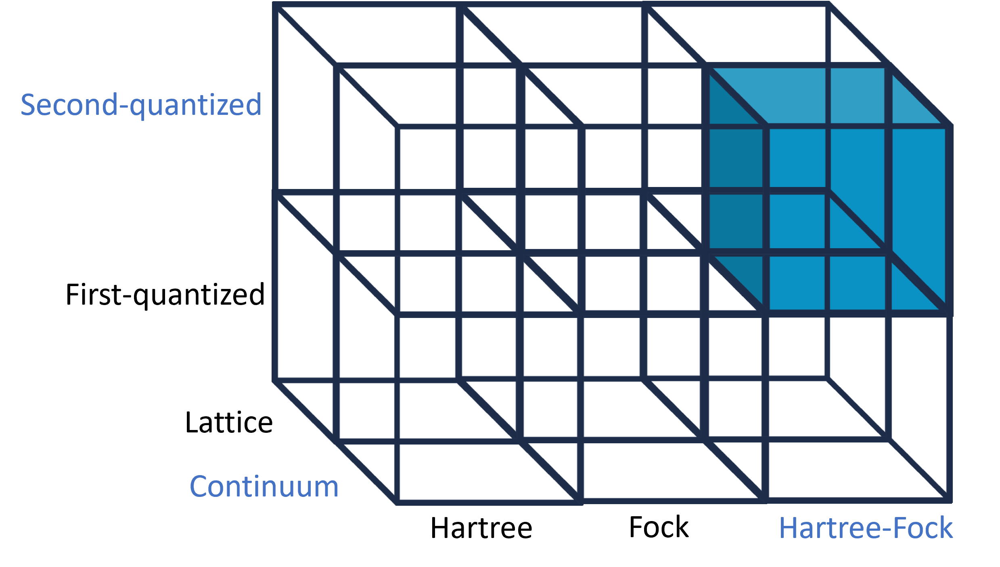
**Example**:  [2108.02159](2108.02159/2108.02159.md)
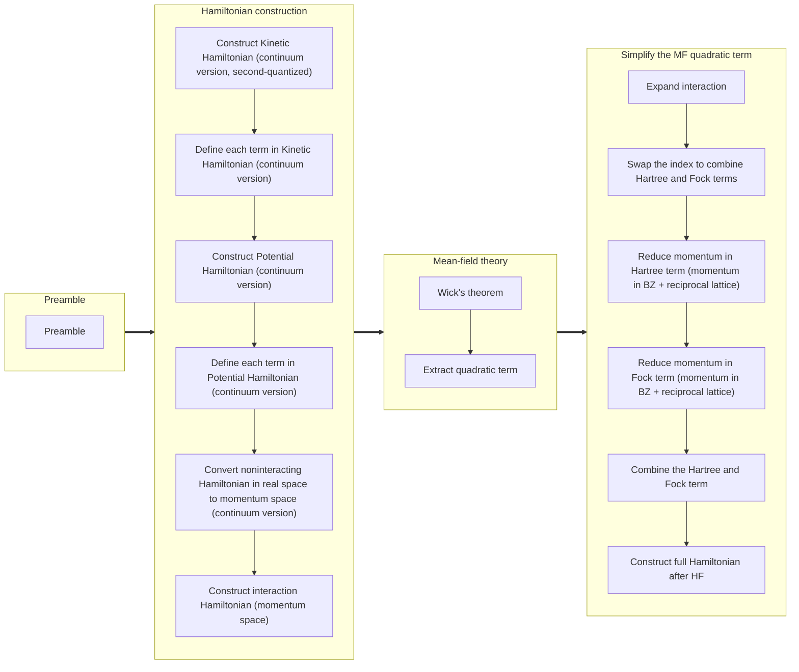
```mermaid
flowchart LR
    subgraph A["Preamble"]
        direction TB
        a1["Preamble"]
    end
    subgraph B["Hamiltonian construction"]
        direction TB
        b1["Construct Kinetic Hamiltonian (continuum version, second-quantized)"]
        b2["Define each term in Kinetic Hamiltonian (continuum version)"]
        b3["Construct Potential Hamiltonian (continuum version)"]
        b4["Define each term in Potential Hamiltonian (continuum version)"]
        b7["Convert noninteracting Hamiltonian in real space to momentum space (continuum version)"]
        b8["Construct interaction Hamiltonian (momentum space)"]
        b1-->b2
        b2-->b3
        b3-->b4
        b4-->b7
        b7-->b8
    end
    subgraph C["Mean-field theory"]
        direction TB
        c1["Wick's theorem"]
        c2["Extract quadratic term"]
        c1-->c2
    end
    subgraph E["Simplify the MF quadratic term"]
        direction TB
        e1["Expand interaction"]
        e2["Swap the index to combine Hartree and Fock terms"]
        e3["Reduce momentum in Hartree term (momentum in BZ + reciprocal lattice)"]
        e4["Reduce momentum in Fock term (momentum in BZ + reciprocal lattice)"]
        e5["Combine the Hartree and Fock term"]
        e6["Construct full Hamiltonian after HF"]
        e1-->e2
        e2-->e3
        e3-->e4
        e4-->e5
        e5-->e6
    end
    A==>B
    B==>C
    C==>E
```